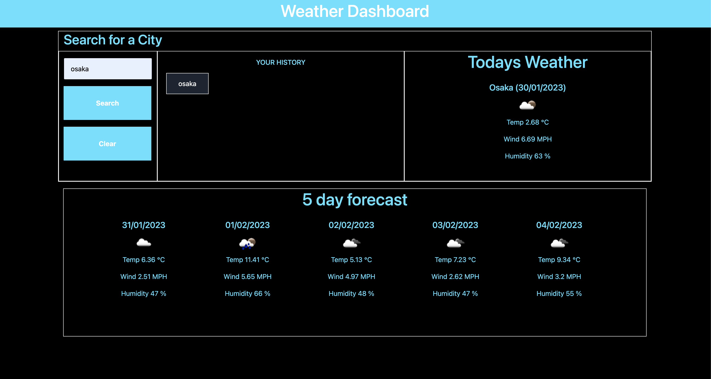

# Vinhs Weather App

## What does it do?

It allows the user to search for a city using the search input and it shows the current weather as well as the forecast for the next 5 days. 

The searched results are also stored in local storage and are visible to the user under the 'Your history' section where the user can click on a city name to retrieve the results for that city. 

### How did I create it?

- MomentJs
- For loop
- Local storage
- conditional statements
- DOM object
- functions
- fetch API
- Bootstrap

### Preview of the application

Here is a preview of the app

[Click here for a Live preview](https://vinhkietla.github.io/VinhsWeatherApp)